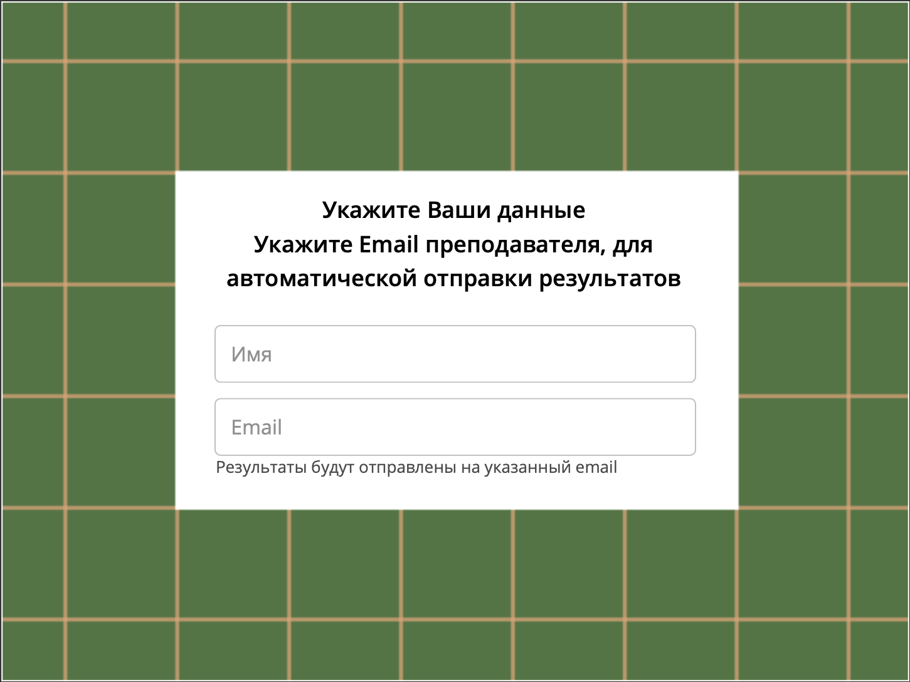

<!-- PROJECT LOGO -->
 

    
     
     
  

     
ДОБРО ПОЖАЛОВАТЬ В БАНК ЗАКРЫТЫХ КОНТРОЛИРУЮЩИХ ТЕСТОВ!
   
  

## СПИСОК ТЕСТОВ:
🔶 **[ОКСИДЫ КЛАССИФИКАЦИЯ](https://argentumpj.github.io/5MOxide/)**  
🔶 **[ФОРМУЛЫ ОКСИДОВ И СООТВЕТСТВУЮЩИХ ГИДРОКСИДОВ](https://argentumpj.github.io/5MHydroxide/)**  
🔶 **[СВОЙСТВА ОКСИДОВ](https://argentumpj.github.io/5MSalt/)**

## ОТПРАВКА РЕЗУЛЬТАТОВ:

🧠 Для запуска теста выберите нужную вам тему;  
  
📝 Пароль от каждого теста уточняйте у преподавателя;
  
Для того, чтобы мы могли проверить ваши результаты, вам необходимо указать свое **Имя** и почту - **argentumproject@yandex.com**

    

 

      
**🍀УСПЕХОВ!🍀**
